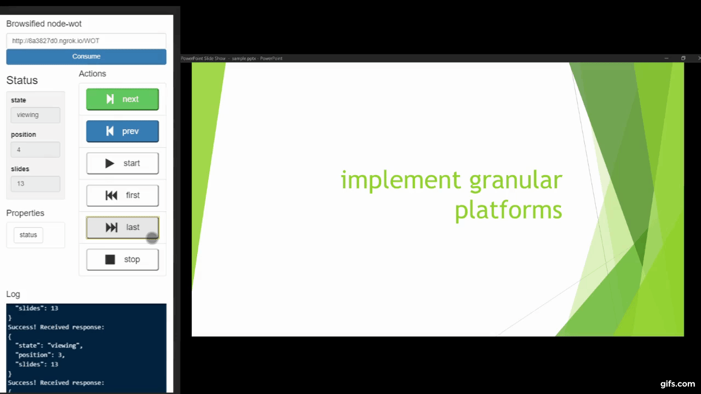
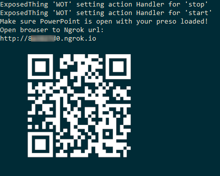
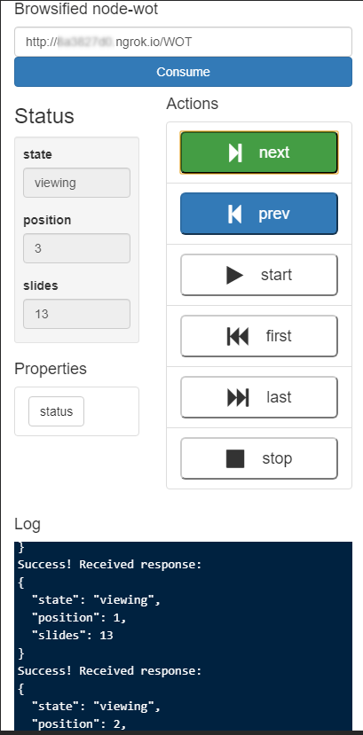

WOT PowerPoint
=========
Impress your spouse, friends, family, and presentation audiences.  

<a href='http://www.youtube.com/watch?feature=player_embedded&v=MiDFFrUtyWY' markdown="1">
<h2>Click to for HQ</h2>

</a>

#### You are awesome!

Use W3C Web Of Things standard to control your PowerPoint presentation. 
https://www.w3.org/WoT/WG/

Usage
-----

### Starting the Server

Clone the repository

`git clone https://github.com/joshco/wot_powerpoint.git`

Install packages

`npm install`

Run

`npm start`

### Open a PowerPoint Presentation
Open PowerPoint and load your presentation or the sample.
There is a sample in the repository to play with.

`sample.pptx`

### Using the client
When the server runs, it will display a URL and QRCode to your auto-made ngrok connection.

> This code goes to this repo, yours will go to your server.  

#### QRCode

Use your phone to scan the QRCode output in the terminal.  
> on iOS, the default camera app will let you scan QRCodes.  A notification will drop down from the top, asking if you want to browse the URL encoded.

#### Manual

Open your browser to the ngrok URL the server printed.  It will look something like:
 
`http://76aaaaaaa.ngrok.io`

When you see the browserified node-wot, click __Consume__

### Controlling your presentation
If your powerpoint is running, you should now see:
* A status box on the left, showing your presentation state
* Buttons on the right, for start/stop/prev/next/first/last, etc
* A log pane is also present, which shows console.log output from the code. 

The interface works on mobile!

License
-------

Copyright (c) 2020 Josh Cohen

This Source Code Form is subject to the terms of the Mozilla Public
License (MPL), version 2.0. If a copy of the MPL was not distributed
with this file, You can obtain one at http://mozilla.org/MPL/2.0/.

